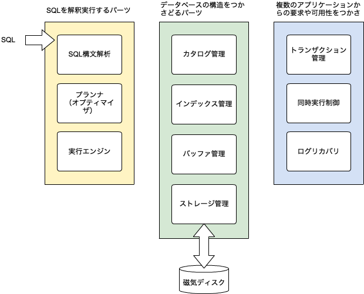
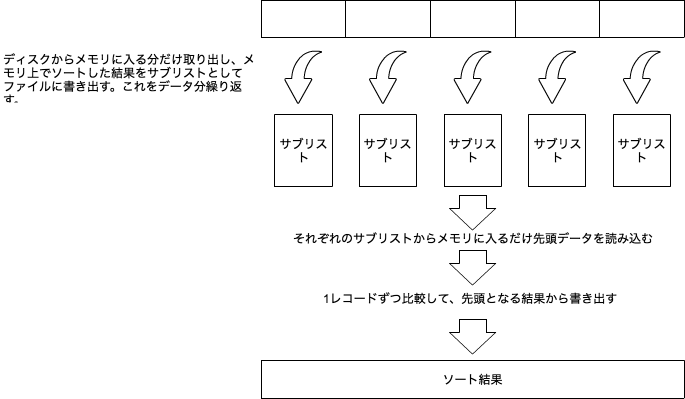

# Chapter1 データベースの基礎とディスクアクセス

## データベースエンジンの構造

### データベースを構成する要素




#### ・SQLを解釈実行するパーツ
##### SQL構文解析
SQLを後で実行できるよう内部形式に変換する。

##### プランナ（オプティマイザ）
構文解析されたSQLを基に、実行プランを作成する。

##### 実行エンジン
プランナが作った手順に従って実際に処理を行う。

#### ・データベースの構造をつかさどるパーツ
##### カタログ管理
データベース内にテーブルやビューがあるか、どんなカラムで構成されているか、そのカラムの属性が何で制約条件はないか等のデータベースの論理構造を管理する。

##### インデックス管理
本言うところの索引。
インデックスを使って行（タプル）を見つけたりタプルが更新された時にインデックスを更新したりする。

##### バッファ管理
テーブルやインデックス等、データベースに保管しているデータを読み書きする際に必要な部分をディスクから取り出したり、書き戻したりする

##### ストレージ管理
データベースを構成するファイルの構造を管理する。
ファイルのブロックサイズやどのファイルに何のテーブルやインデックスを格納するかを決める。
また、ファイル入出力のシステムコールを呼び出す。

#### ・複数のアプリケーションからの要求や可用性をつかさどるパーツ
##### トランザクション管理
アプリケーションにとって意味のある処理単位でデータベースを更新できるようにする。
commit、rollbackを管理。

##### 同時実行制御
SQLが同時に投げられた際にロックやMVCC(Multi Version Concurrency Control)などの手法を使って処理が干渉しないように管理する。

##### ログリカバリ
データベースに異常が起きた場合にデータを復元するための情報となるバックアップログを記録する

## データベースと磁気ディスク～磁気ディスクはメモリより百万倍遅い～

磁気ディスクのデータの読み書き速度はメモリに比べて百万倍遅いと言われている。
データベースは主に磁気ディスク上のデータを扱うのでデータをメモリにロードしたり書き戻したりする際に以下のような工夫をしている。

* データはなるべくファイルの先頭から順に読み書きする（シーケンシャルアクセス）
* 複数のプロセスからの入出力要求をまとめて実質的な入出力回数を減らす
* 必要以上のデータの書き出しは行わない。OSのキャッシュに書き出してから、まとめてディスクに書き出す

## ディスクを使った処理の特徴～メモリ上の処理とはまるで違う～

- クイックソートアルゴリズム
http://www.ics.kagoshima-u.ac.jp/~fuchida/edu/algorithm/sort-algorithm/quick-sort.html

- マージソートアルゴリズム
http://www.ics.kagoshima-u.ac.jp/~fuchida/edu/algorithm/sort-algorithm/merge-sort.html

### 実習
```
マージソートアルゴリズムをPerlで書いてみよう。
~src/chapter1/merge_sort.txtのデータを昇順に並び替える。

[手順]
メソッド mergeSort() 
与えられた配列 a[ ] をほぼ2等分し、それぞれの配列を mergeSort() で並べ替えた後、
2つを併合して1つの配列にしています。
この処理は、配列の大きさが１になるまで、再帰的に呼び出されます。

メソッド merge() 
3つの配列 a1[ ] , a2[ ] , a[ ] を受けて、a1 と a2 を併合した配列を a に格納して
戻ります。このとき、a1 , a2 の小さいほうから順番に取り出して a に格納するので、
a1 と a2 が整列された配列ならば、a も整列された配列になります。


```


データがメモリに収まるような場合、クイックソートのような高速なアルゴリズムが向いている。
しかしディスクアクセスが発生する場合、不規則にデータを読み込むと効率が悪くなる。
ディスクアクセスの場合はマージソートアルゴリズムのような先頭から読み込む方法が好ましい。

1 メモリに入るだけのデータを磁気ディスクから読み込む
2 メモリ内でソートして別ファイルに書き出す（サブリスト）
3 全サブリストからメモリに入るだけ先頭データを取り出し、１レコードずつ比較する
4 これを繰り返して取り出したデータがソート結果となる


