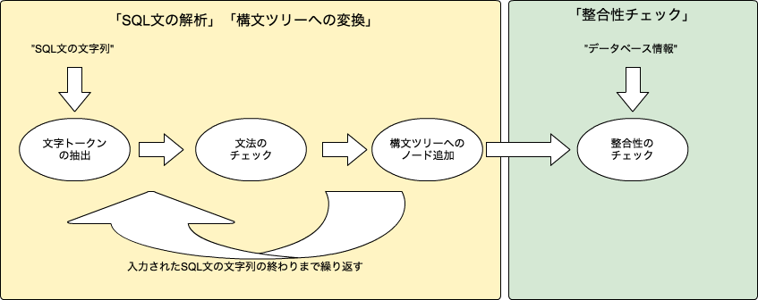

# Chapter 2　SQLをどう料理するか（1）　SQLの構文解析

## SQLの重要性

## 構文解析（パース）とは

### SQL構文解析の役割

SQL構文解析は「SQLの構文の解析」、「内部形式（構文ツリー）への変換」、「整合性チェック」の3つの部分に分けられる。

- SQL文の解析

シンタックスチェック

- 内部形式（構文ツリー）への変換

SQLを「SELECT」、「カラム名」、「数値」など意味のある単位に分割する。
構文ツリーの目的は、各項目単位の文字列へのアクセスを容易にすること。
構文ツリーを使用して以後のSQL文を効率よく処理できるようにする。

- 整合性チェック

SQL文の内容とデータベースに格納されている内容の整合性チェックを行う。

- テーブルの有無
- 属性の有無やデータ型
- 集約関数の有無

直接データを見に行ってチェックするのではなくカタログ管理のパーツを介してデータベースの情報を取得してチェックしている。

### 構文ツリーとは

#### SELECTの一般式

```
SELECT < 属性リスト >
FROM < テーブル名 >
WHERE < 条件式 >
GROUP BY < 属性リスト >
HAVING < 条件式 >
ORDER BY < 属性リスト >
```

この一般式の構文ツリー


#### 構文ツリーの具体例1

- SQL

```
SELECT 従業員名 FROM 従業員テーブル
WHERE 性別 = '男'
```

- 構文ツリー


#### 構文ツリーの具体例2

- SQL

```
SELECT 従業員名 FROM 従業員テーブル
WHERE 部署番号 IN (
	SELECT 部署番号 FROM 部署テーブル
	
)
```

- 構文ツリー


## 構文解析処理の実装

- 構文解析処理の流れ



解析処理は構文ツリーを作成する前半部と整合性チェックの後半部に分かれる。

### 構文ツリーの作成（前半部）

- - 文字トークンの抽出

SQL文を字句パターンをマッチングを行い文字トークンを抽出する。

	- SELECTやFROMなどのキーワードとなる文字列
	- カラム名やテーブル名など意味のある文字列
	- 演算子（「>」や「+」）
	- 「,」や「'」

- 文法のチェック

文字トークンが抽出されるごとに文法が正しいかチェックをする。
文法チェックも事前に用意したパターンとマッチングで処理する

- 構文ツリーへのノード追加

文法チェックが終了するごとに構文ツリーの該当するノートへ文字トークンを追加する。
すべて終了すると構文ツリーが完成する。

### 整合性チェック（後半部）

カタログ管理からデータベース情報を入手してSQL文の内容と整合性をチェックする。
このときに構文ツリーを使用してチェックすることで効率よくチェックを行うことができる。
