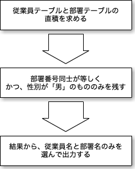

# Chapter3　SQLをどう料理するか（2）　SQLから演算へ

## この章のテーマ

構文解析の結果作られた構文ツリーを元に実行プランを作成する「プランナ（オプティマイザ）」について説明する。

構文解析⇨プランナ[**論理プラン作成**⇨物理プラン作成]

ここではプランナの中でも論理プラン作成部分についての説明をする。


## 論理プランと物理プラン

- 論理プラン

データベースの処理手順を「関係代数」の言葉で書き下したもの

- 物理プラン

論理プランをコンピュータ上の実行手順に書き換えたもの

## 関係代数とは

RDBMSは関係代数を基につくられている

1. 和、共通部分、差

2つのリレーションのタプルを全て合わせたものが「和」。共通するタプルだけを集めたものが「共通部分」。共通部分を取り除いたものが「差」である

| 社員番号 | 名前 | 性別 | 部署番号 |
| ---: | ---:| ---:| ---:|
| 100010 | 山田 | 男 | 200 |
| 100020 | 鈴木 | 男 | 300 |
| 200010 | 佐藤 | 女 | 200 |
| 100030 | 高橋 | 男 | 100 |
| 200020 | 山本 | 女 | 300 |

\+
    
| 社員番号 | 名前 | 性別 | 部署番号 |
| ---: | ---:| ---:| ---:|
| 200040 | 小泉 | 男 | 100 |
| 300050 | 森   | 女 | 200 |
| 300020 | 橋本 | 男 | 300 |

↓

| 社員番号 | 名前 | 性別 | 部署番号 |
| ---: | ---:| ---:| ---:|
| 100010 | 山田 | 男 | 200 |
| 100020 | 鈴木 | 男 | 300 |
| 200010 | 佐藤 | 女 | 200 |
| 100030 | 高橋 | 男 | 100 |
| 200020 | 山本 | 女 | 300 |
| 200040 | 小泉 | 男 | 100 |
| 300050 | 森   | 女 | 200 |
| 300020 | 橋本 | 男 | 300 |

- 選択
あるリレーションのタプルのうち、与えられた条件に一致するタプルのみを選ぶ。
SQL文のwhere句に相当。

- 射影

あるリレーションのタプルから指定された属性（カラム）のみを取り出して新しいリレーションを作る

- 直積（または積）

2つのリレーションのタプルを組み合わせて新しいタプルを作る。全ての組み合わせに対してこれを行う。

| 社員番号 | 名前 | 性別 | 部署番号 |
| ---: | ---:| ---:| ---:|
| 100010 | 山田 | 男 | 200 |
| 100020 | 鈴木 | 男 | 300 |
| 200010 | 佐藤 | 女 | 200 |
| 100030 | 高橋 | 男 | 100 |
| 200020 | 山本 | 女 | 300 |

×

| 部署番号 | 部署番号 |
| ---: | ---:|
| 100 | 総務 |
| 200 | 営業 |
| 300 | 開発 |
↓
| 社員番号 | 名前 | 性別 | 部署番号 | 部署番号 | 部署名 | 
| ---: | ---:| ---:| ---:| ---:| ---:|
| 100010 | 山田 | 男 | 200 | 100 | 総務 | 
| 100010 | 山田 | 男 | 200 | 200 | 営業 | 
| 100010 | 山田 | 男 | 200 | 300 | 開発 | 
| 100020 | 鈴木 | 男 | 300 | 100 | 総務 |
| 100020 | 鈴木 | 男 | 300 | 200 | 営業 |
| 100020 | 鈴木 | 男 | 300 | 300 | 開発 |
....

- 結合

結合種類は何種類かあるが等結合を説明する。
２つのリレーションの特定の属性が等しいカラムをつなげて１つにしたタプルからなるリレーション

| 社員番号 | 名前 | 性別 | 部署番号 |
| ---: | ---:| ---:| ---:|
| 100010 | 山田 | 男 | 200 |
| 100020 | 鈴木 | 男 | 300 |
| 200010 | 佐藤 | 女 | 200 |
| 100030 | 高橋 | 男 | 100 |
| 200020 | 山本 | 女 | 300 |

× 部屋番号が同じ

| 部署番号 | 部署番号 |
| ---: | ---:|
| 100 | 総務 |
| 200 | 営業 |
| 300 | 開発 |

↓

| 社員番号 | 名前 | 性別 | 部署番号 | 部署番号 | 部署名 | 
| ---: | ---:| ---:| ---:| ---:| ---:|
| 100010 | 山田 | 男 | 200 | 200 | 営業 | 
| 100020 | 鈴木 | 男 | 300 | 300 | 開発 |
| 200010 | 佐藤 | 女 | 200 | 200 | 営業 | 
| 100030 | 高橋 | 男 | 100 | 100 | 総務 | 
| 200020 | 山本 | 女 | 300 | 300 | 開発 |

この等結合は直積と選択を組み合わせて行うこともできる。
1. リレーションの直積を求める
2. この直積で結合属性が等しいもののみを選択する。

その他、重複除去（DISTINCT）、グループ化（GROUP BY）、ソートなどもある。


## SQLから論理プランへ～SELECT文の処理原理～

```
SELECT < 属性リスト >
FROM < テーブルリスト >
WHERE < 条件式 >
GROUP BY < 属性リスト >
HAVING < 条件式 >
ORDER BY < 属性リスト >
```

- 上記SQLを処理する手順

1. FROM句のテーブルリストにあるテーブルの直積を作る。テーブルにビューがあればビューを定義しているSELECT分の結果との直積を作る。
2. WHERE句がある時は、その条件に合致するものだけを1の結果から選び出す
3. GROUP BYがある時は、2の結果の属性リストの値が全て同じものをグループに分ける。その後は、このグループごとに処理する。
4. SELECT句の属性リストのうち計算が必要なものは、計算を行う。属性リストにはCOUNT、MAX、SUM、AVERAGEなど複数のタプルから計算するものもある。この計算は3のGROUP BYで分けたグループごとに行う。そうでないものはタプルごとに計算する。
5. HAVING句がある時は4の結果のうち、条件に合うもののみを結果として取り出す。
6. 最後にSELECTの属性リストに指定されたもののみを結果として取り出す。HAVING句では、SELECT属性にない属性を使うこともできるので、SELECTの属性リストの取り出しは最後になる。

単純に考えると上記の手順になるがこれには問題がある。


## SELECT文の処理～問題は何か？～
| 社員番号 | 名前 | 性別 | 部署番号 |
| ---: | ---:| ---:| ---:|
| 100010 | 山田 | 男 | 200 |
| 100020 | 鈴木 | 男 | 300 |
| 200010 | 佐藤 | 女 | 200 |
| 100030 | 高橋 | 男 | 100 |
| 200020 | 山本 | 女 | 300 |

| 部署番号 | 部署番号 |
| ---: | ---:|
| 100 | 総務 |
| 200 | 営業 |
| 300 | 開発 |

上記の例で従業員が1000人いて部署が30あった場合、1の手順を行うと30000もんタプルが作成され非効率である。これをもっと効率の良いプランに変えるのがプランナの仕事である。

## 論理プランの改善

論理プランの改善で一番重要な点は直積から等結合への変換である。

```
等結合とは
1. リレーションの直積を求める
2. この直積で結合属性が等しいもののみを選択する。
```

以下の例を考える


```
SELECT 従業員名,　部署名
FROM 従業員テーブル, 部署テーブル
WHERE 従業員テーブル.部署番号 = 部署テーブル.部屋番号
	AND 性別 = '男'
```

- 原理的な処理手順




- 書き換えて直積を結合に


- さらに書き換えて結合の数を減らす


プランナは論理プランをいろいろ変形させて最適なプランを選んでいく。
今回のようにSELECT分の形だけから最適なプランを選択するには限度がある。
絞り込むデータの割合やインデックス、これまでの実行結果などから最適な方法を選ぶ。
プランナの出したプランを強制的に変更できるようにして、プランナでこなしきれない最適化を人間ができるようにしている製品もある。