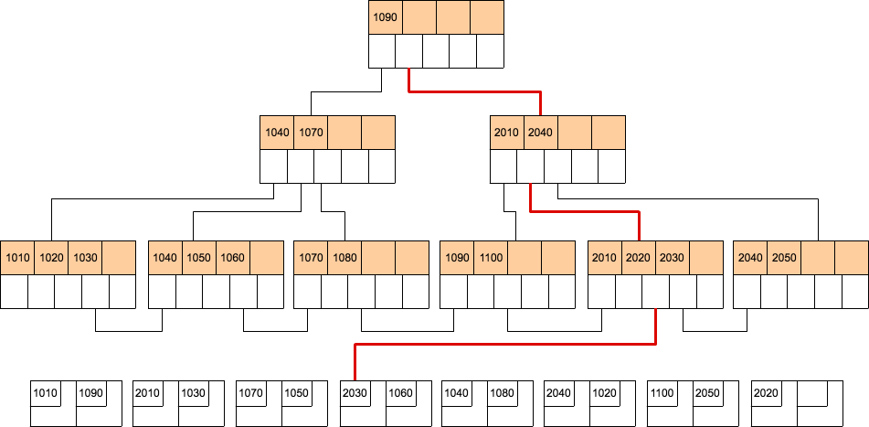

# Chapter4　カタログとインデックス

## カタログとは

カタログには具体的に以下のような情報が格納されている。

- データベース情報

    データベースの名称や、その所有者などの情報を格納

- テーブル情報

	データベース内に存在するテーブルの名称や、その所有者の情報を格納
    
- ビュー情報

	データベース内のビューの名称や所有者、ビューの内容を格納する。
    RDBMSによって様々だがビューのSELECT文をそのまま格納していることが多い。
    
- カラム情報

	テーブル内のカラムの名称やデータ型、デフォルト値などの情報が格納される
  	デフォルト値は制約情報として扱われる場合もある
    
- インデックス情報

	データベース内のインデックスの名称、種類、その所有者、どのテーブルのどのカラムのインデックスなのかといった情報を格納する。


- 制約情報

	定義された制約の名称や種類、どのテーブルのどのカラムに対する制約なのかといった情報を格納する。（プライマリキー制約、一意制約、外部キー制約）
    

- データベースユーザー情報

	データベース内のユーザーの名称や権限などの情報を格納する。
    
- 統計情報

	カラムの最大値や最小値、種類数など、データベース内の各種統計情報を格納する。
    
- ストアドプロシージャ/ トリガー情報

	データベース内のストアドプロシージャ/ トリガーの名称やその所有者、内容などの情報を格納する。SQLのオプティマイズ結果を格納するので通常のSQLよりも高速に動作する。
    
- 性能情報

	ある一定時間内に発生したディスクへの読み書き回数などの性能に関係する情報を格納する。
    
 
### SQLを使用したカタログ情報へのアクセス

カタログ情報はデータベース内にテーブル群として格納されているため、SQLでアクセスできる。
 
※Postgresqlだと以下のリンク先のテーブルにカタログ情報が格納されている

https://www.postgresql.jp/document/9.6/html/catalogs.html


```
select * from pg_user where usename = 'postgres';
select * from pg_database;
```

### データベースエンジン内からカタログ情報へのアクセス

1. SQL構文解析の整合性チェック

SQL文の構文解析処理でSQL文の内容と実際のデータベース情報との整合性をチェックする際にカタログ情報を参照する

2. 最適プランの選択

プランナは最適なプランを選択する際に指標としてカタログ情報を参照する（後章で説明）

上記からわかるようにSQLを受け取る毎にカタログ情報へアクセスしているのでカタログ情報はメモリ上に確保しておく。
メモリ上にはカタログ情報専用の領域が確保されていて、ハッシュテーブルでデータを高速に抽出できるよう管理されている。

## インデックスの効用

- インデックスの長所

	 - 検索速度が速くなる場合がある

- インデックスの短所

	- インデックスを格納するためのディスク容量を必要とする
	- 更新処理の性能が悪くなる

インデックスは長所の効果が絶大だが適切な設計が必要となる


## Bツリーインデックス

BツリーインデックスはRDBMSで最も多く使用されているインデックスである。
Bツリーインデックスはノードと呼ばれるインデックス値とポインタの木構造が階層的に接続されて木構造を構成する。

| 社員番号 | 名前 | 性別 | 出身地 | 
| ---: | ---:| ---:| ---:|
| 1010 | 山田 | 男 | 東京 | 
| 1090 | 鈴木 | 男 | 神奈川 |
| 2010 | 佐藤 | 女 | 東京 |
| 1030 | 高橋 | 男 | 東京 |
| 1070 | 山本 | 女 | 東京 |
・
・
・

```
SELECT * FROM 社員テーブル WHERE 社員番号 = '2030'
```

### インデックスを使用しない場合


データ部のブロックを順番に参照して該当のレコードを探す。対象のレコードがいくつあるかわからないので。データ部の全ブロックを参照する必要がある。

参照ブロック数：8個

### Bツリーインデックスを使用した場合



ルートノードから順に大小比較を行い参照するポインタを決定する。
最後にリーフノードが参照するデータ部のブロックから該当のレコードを見つける。

参照ブロック数：4個

## ビットマップインデックス


ビットマップインデックスはインデックス値をビット列で表現することで必要なデータ容量を大幅に削減している。インデッックスに必要な容量を減らすことができれば参照ブロック数を削減することができる。
ビットマップインデックスは検索処理が中心のDWHで使用される。

```
SELECT * FROM 従業員テーブル WHERE 性別 = '女' AND 出身地 = '東京'
```


上記の図からわかるように性別テーブルのインデックスには2bit+ポインタで1レコードのインデックスとなることがわかる。