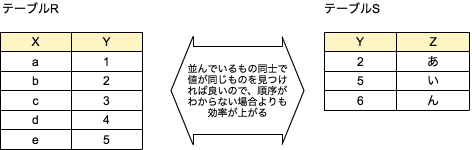

# Chapter 5　SQLの実行エンジン

実行エンジンはプランナが作成した物理プランを実行する。
（物理プランについてはChapter6）

SQLの実行エンジンは単一の処理で構成されるのではなく、常に多数の機能の組み合わせになっている。この構造に加えて、代表的な機能モジュールについても説明する。
物理プランはこの機能モジュールを実行する順番を決める。

## 実行エンジンの役割とSQLの処理

- 実行エンジンはSQLを実際に処理する部品
	- いろいろな関係演算を実行する部品郡である
		- 直積や結合の関係演算そのものの処理
		- テーブルのタプルを順に読む処理
		- カラムに特定の値を持つタプルをインデックスを使って読む処理
 - 一つの関係演算でも、実行には何種類もの方法がある
 	- どの方法が効率良いかは様々な要素に依存する
 		- テーブル中のタプルの数
 		- その中のカラムの値
 		- インデックスのありなし
 		
        →つまり全てのケースで効率が良い処理方式はなかなか見つからない
        
    - 単純な関係演算の実行のためにも何種類もの機能モジュールが実装されている
        
- 1つのSQLは関係演算のエンジンが組み合わされて順次処理されていく


```
２つ目の処理はディスクを経由していないので処理が速い。
しかし、結合演算部でもディスクに中間結果を書き出さずに処理できるようなデータになっていないと全体の効率は上がらない。あるいは結合処理を効率化するために従業員テーブルを部署番号順にソートするなど。データ読み出し部で中間データをディスクに格納すれば、パイプラインの効果は無くなってしまう。
つまり2つめの手段を使える場面は限られる。
```

- ケースバイケースで最適な処理をしようとすると、何種類もの実行モジュールを用意して、うまく使い分ける必要がでてくる。
- どのような演算が行われるかはEXPLAIN文で見ることができる。

例）PostgresのEXPLAIN
```
EXPLAIN SELECT sum(i) FROM foo WHERE i < 10;
                    QUERY PLAN
--------------------------------------------------------------------
Aggregate (cost=23.93..23..93 rows=1 width=4)
        -> Index Scan using fi on foo (cost=0.00..23.92 rows=6 width=4)
                Index Cond: (i < 10)
(3rows)
```

- 計画ノード
実行計画はツリー状でその単位を計画ノードという
最上位の計画ノードには計画全体の推定コストが含まれる

- cost
処理の推定コスト
任意の単位で相対的な数値を示す
左：最初の行を返すまでのコスト
右：最後の行を返すまでのコスト

```
cost=Disk/IOコスト　＋　CPUコスト
cost=ディスクからフェッチするページ数 * seq_page_cost + スキャンした行 * cpu_tuple_cost
```
seq_page_cost：（1ディスクページあたりの読み取りコスト）を1.0に設定
cpu_tuple_cost：問い合わせそれぞれの行の処理に対するプランナの推測（デフォルト0.01）

- rows
計画ノードが出力する行の推定値

- width
計画ノードが出力する行の平均バイト数


- Explain結果の読み解き
  - インデックスを使用して条件に合致するタプルを6つ見つける
  - その結果に集約演算を施して最終的に1つのタプルを出力

※Postgresには実際にSQL文を実行するEXPLAIN ANALYZEも存在する

## 実行エンジンの機能モジュールのインターフェイス

代表的な機能モジュールを紹介する。
これらの具体的な実装は各RDBMSでそれぞれで独自に実装されている。
標準のインターフェースや規約が存在しているわけではない。

### テーブルスキャン

最も基本的な機能モジュール
タプルを読み込む順番に決まりはなくディスクに格納されている順番で取り出される。
ディスクに格納されている順序は、書き込みの順序、削除や更新履歴に大きく影響される。

```
select * from tab1;
```

↑のSQLはテーブルスキャンのみを使用する。


### ソートスキャン

特定のカラムの値に従ってタプルをソートし、その順番にカラムを渡す処理。
order by が含まれるSQL文にはもちろん使用される。
結合演算やgroup byのような集約演算が使用されている場合にはソートスキャンをしておくと後の処理が効率よく処理できる場合がある。

テーブルサイズがメモリ内に収まる場合は高速なメモリ内のソートアルゴリズムが使用できる。
収まらない場合はディスクに中間結果を書き出しながら処理する。
またソート対象のカラムにインデックスが存在する場合は、インデックスのカラムの値の順にタプルを探していけるので処理が高速になる。


### ネストループ結合

結合演算の基本的な機能モジュール
万能だが性能を得るのは難しい。結合の最終手段。


ネストループ結合はそれぞれのテーブルのカラムを1つずつ比較して総当りで調べていく。テーブルスキャンと等しく取り出す順序が保証されていないので正直に1つずつ調べていくしかない。

```
テーブルRからタプルを1つ取り出す
	テーブルSからタプルを1つ取り出す
		RのタプルのカラムYとSのタプルのカラムYが等しいか調べる
		等しければ2つのタプルを結合させたカラムを出力する
		等しくなければ次のタプルの対を調べる
	ループ終わり
ループ終わり
```

両方のテーブルがメモリに格納できるのであれば、ディスクからの読み込みは1回で済む。どちらか片方だけでも処理はかなり楽になる。できるだけ多くのタプルをメモリに読み込んでおいて、メモリ中のデータから先に調べていくことでディスクI/Oの数を減らすことができる。

### ソートマージ結合



1. テーブルRをYでソートする
2. テーブルSもYでソートする
3. RとSをソートしたものから1つずつ順にタプルを取り出して調べていく
	1. RのYの値よりSのYの値が大きいなら、Rから次のタプルを取り出して3の最初からやり直す
	2. RのYの値よりSのYの値が小さいなら、Sから次のタプルを取り出して3の最初からやり直す
	3. RのYの値とSのYの値が同じなら、この2つのタプルは結合する。RとSから次のタプルをそれぞれ取り出して3の最初からやり直す
	4. RあるいはSの最後のタプルの最後まで調べたら、すべての結果が出力できたことになる

ネストループと比べて両方のテーブルを１回ずつした読んでいないため、ネストループに比べてかなり高速化が期待できるが、2つのテーブルをソートする処理が別途必要となる。そのためどちらが高速になるかは場合による。この辺りはChapter6で。

### インデックスを使った結合


インデックスはソートされているので、それぞれのインデックスをソートマージ結合と同じように調べていく。インデックスはすでに作成されているので、前もって別途ソートする必要もない。それぞれのテーブルの結合カラムにインデックスを作成しておくと良い理由はここにある。

### ハッシュ関数を使う方法


カラムの値をハッシュ関数に通す。通した結果を分類してバケットと呼ばれる入れ物に入れる。
バケットの中にはカラムの値と一緒にタプルのディスクやメモリ上のポインタを入れておく。
これをハッシュテーブルと呼ぶ。

このハッシュテーブルを作ることでインデックスやソートよりもかなり効率よくデータを分類できる。この構造をインデックスとして使用することもでき、ハッシュインデックスと呼ばれている。

ハッシュはランダムアクセスに特化したアルゴリズムなので範囲検索には使用されない。
ソートにも効果がない。


## まとめ

どのような場面でも効率を発揮できるような処理方法は見つかっていない。
それぞれの処理特性と実際のデータの特性（タプル数、サイズ、着目する絡むの値の範囲、その分散の具合など）で処理を決める。この処理を決めるのが物理プランと言われる部分である。
