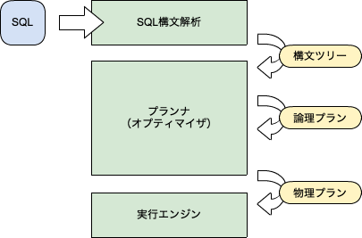
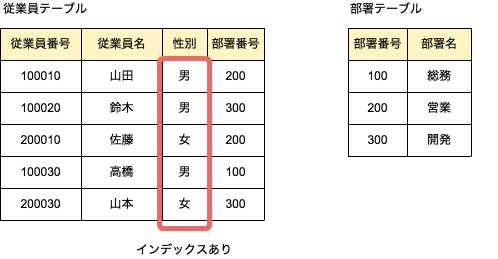
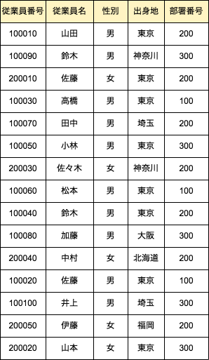

# Chapter 6　物理プランの生成

## 物理プラン生成の位置付け




1. SQL文を構文解析して構文ツリーを作成する。
カタログ情報を参照して整合性をチェックして、構文ツリーをプランナに渡す。

2. プランナは関係代数の演算を用いて論理プランを作成する。
論理プランは関係代数の規則や性質を利用して、より効率の良いものが生成される。この時点でどんな演算をすればSQL文の回答を生成できるかが判明する。


3. プランナは論理プランから物理プランを生成する。
その際に実行エンジンが持つ機能モジュールをどんな順番で実行するのが最適かを検討する。生成した物理プランを実行エンジンに渡す。

4. 実行エンジンは物理プランを受け取り、プラン内の処理の順序に従って、各種機能モジュールを動作させ、SQL文の答えを作成する。
ここで初めて、ディスク上に存在するデータを読み書きする。

物理プランを生成するということは論理プランに記述された関係代数の演算を、実行エンジンの最適な処理手順に記述し直すことである。


## 物理プランの最適化とは

- SQL文
```
SELECT 従業員名, 部署名 FROM 従業員テーブル, 部署テーブル
WHERE 従業員テーブル.部署番号 = 部署テーブル.部署番号
AND 性別 = '男'
```

- テーブル


- 論理プラン

	- 従業員テーブルで、性別が「男」のタプルを選択する
	- 上の結果と部署テーブルとの直積を求め部署番号が等しいタプルを選択する
	- 結果から従業員名と部署名のみを射影して出力する

- 物理プラン

	- 従業員テーブルで、性別が「男」のタプルを選択する
		- 性別カラムのインデックスを使用して「男」のタプルを見つける
			⇨インデックススキャンモジュール
		- 従業員テーブルの前レコードをチェックして性別が「男」のものを見つける
		 	⇨テーブルスキャンモジュール
	- 上の結果と部署テーブルとの直積を求め部署番号が等しいタプルを選択する
		- データベースが搭載している結合処理の数だけ選択肢がある
			⇨ネストループ結合モジュール
            ⇨ソートマージ結合モジュール
            ⇨ハッシュ結合モジュール

	- 結果から従業員名と部署名のみを射影して出力する
		⇨フィルタモジュール

	```
	2種類 × 3種類 × 1種類 = 6種類の物理プラン
    ``` 
    
    この6種類から最良と思われる物理プランを見つける
    
- 最適な物理プランとは？

	- 実行する処理時間が一番短いもの
		- データファイルのフラグメンテーションやCPUやディスクI/Oの負荷に左右される
		実際に計測するのは難しいので、何らかの指標を用いて予想を立てる。
        
        - 複雑なSELECT文になればプランの選択肢は増える
        	⇨プランの最適化に多くの処理時間を費やしては本末転等

	最適な物理プランの生成は、データベースシステムにとって非常に重要な課題。


## 物理プランの最適化方式

「ルールベース方式」と「コストベース方式」がメジャー
実用化されていないものも存在する。

### ルールベース方式

比較的古くから実用化されている方式。
事前に物理プラン選択の優先順位を定義したルールを用意して、該当する物理プランのうち、一番優先度の高いものを選択する。

Oracleは9iまでルールベース方式を使用していた。

|優先順位|アクセスパス
| :--: | :--: |
| 1 | ROWID による単一行|
| 2 | クラスタ結合による単一行|
| 3 | 一意キー or 主キーのハッシュ・クラスタ・キーによる単一行|
| 4 | 一意キー or 主キーによる単一行|
| 5 | クラスタ結合|
| 6 | ハッシュ・クラスタ・キー|
| 7 | インデックスクラスタ・キー|
| 8 | 複合列によるインデックス（複合インデックス／旧名？：連結インデックス）|
| 9 | 単一列によるインデックス|
| 10 | インデックスレンジスキャン（上下限つき、前方一致）|
| 11 | インデックスレンジスキャン（上限または下限）|
| 12 | ソート・マージ結合|
| 13 | インデックス列の MAX、MIN|
| 14 | インデックス列の ORDER BY|
| 15 | テーブルフルスキャン|


### コストベース方式

カタログ内の各種統計情報を参照してコストと呼ばれる最適化の指標を算出する。そのコストの値が最も小さい物理プランを選択する。

ex)カラムにインデックスが存在していても、データ量が極めて小さいテーブルの場合、テーブルスキャンが実施される。
この後、データ数が増えていくとインデックススキャンが選択されるようになる。
⇨（データの統計情報が正しく更新されている場合）

一般的にコストベース方式の方がルールベース方式より最適なプランを生成できるため、最近のデータベースにはコストベース方式を採用したプランナが実装されている。


## コストベース方式の例

こすとベースの一般的な考え方を以下の例で説明する

```
SELECT 従業員名 FROM 従業員テーブル
WHERE 出身地 = '北海道'
```



### インデックスが存在しない場合

出身地カラムにインデックスがない場合は、従業員テーブルのテーブルスキャン1択

### インデックスが存在する場合

「テーブルスキャン」か「インデックススキャン」どちらを選択するか。


## まとめ