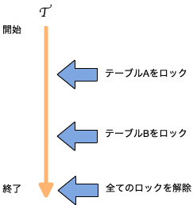

# Chapter 7　トランザクションの基礎

## トランザクションとは

アプリケーションにとって意味のある処理の単位のこと

Rollbackまたはcommitを実施すると新しいトランザクションが開始される。また、明示的にトランザクションを開始する場合はBeginを用意しているデータベースシステムもある。

## トランザクションをどのように保証するか

### commit

トランザクションで行ったデータベースの変更を確定する

### Rollback

トランザクションで行った変更を無効にして、トランザクション開始前の状態に戻す。

### トランザクション処理の実現
-  update、deleteの場合は変更前のタプルの内容を別の場所に書き込んでおく 
-  commitする場合は古い値を無効にする
-  Rollbackする場合は新しい値を無効にして古い値を有効にする

### 元に戻すデータ（アンドゥ情報）の保持
- レコード直接更新型
	- 多くのDBはDB自信を変更して、別の場所（Rollbackセグメントなど）に元の情報を格納する
- 追記型
	- Postgresのような追記型のDBは新しいレコードを追加して、古いレコードはそのままにしておく（commit時にどちらかを無効にする）
	- MVCC(Multi-Version Concurrency Control)の実装が単純になるなどのメリットがあるが、データベースの中が虫食い状態になってしまう
	- これを再利用したり、再編成したりするためにPostgressはVaccuum処理を用意している。

SQL文の影響を受けるデータ量に応じてRollbackセグメントなどのストレージを十分に確保する必要がある。またRollbackする再には対象データを元に戻したり、書いたデータを無効にするディスクの入出力が必要になる。

## 同時実行制御～複数のトランザクションが同時に実行される場合～

トランザクションは並列に複数実行される。同時に複数のトランザクションを更新しようとすると不具合が発生する可能性がある。このような不具合は大きく3つに大別できる。

- 更新の消失（Lost Update）

2つのトランザクションが同じデータに対して書き込みを行うと、最初に書いたデータが失われてしまう。

- ダーティリード（Dirty Read）

あるトランザクションが変更中の未確定のデータを別のトランザクションで読み込んでしまう。

- 非再現リード（Unrepeatable Read）

あるトランザクションが値を変更した場合、別のトランザクションから同じデータを参照すると、更新の前と後で値が変わってしまう。

## トランザクションの干渉を防ぐ～ロックのメカニズ～

複数トランザクション間の干渉を防ぐためにロック機能が用意されている。

- ロックの性質
	- ロックをかける主体はトランザクションで、トランザクションが完了するとロックも開放される
	- ロックはデータベースオブジェクトに対してかけることができる
		- データベース全体
		- テーブル
		- テーブルの中のカラム
		- データベースを構成する物理ファイルブロック
	- データベースオブジェクトにアクセスするには、ロックを取得する必要がある
		- 他のトランザクションがロックしている場合は、取得できるようになるまで待たされるか、エラーとなる

- ロックの種類
	- 書き込みロック（排他ロック）
		- 他のトランザクションが読み書きできない
		- 書き込みロックを取得できるトランザクションは1つのデータベースオブジェクトに対して1つだけ

	- 読み出しロック（共有ロック）
		- 他のトランザクションから変更できないがロックを取得して読み出すことはできる
		- 読み出しロックは1のデータベースオブジェクトに対して複数のトランザクションが取得できる。読み出しロックがかかっているオブジェクトに足して書き込みロックをかけることはできない。
		- 例外として読み出しロックを取得しているトランザクションが1つの場合は書き込みロックを取得できる

## ロックをかける単位とロックの解放

- 行ロック
    - 行単位のロック
	- RDBMSでは通常のSQLに対しては行ロックが主に用いられる
	- 実装が複雑のためRDBMSによってはページ単位にロックをかける場合もある
		（この場合、同じページに格納されているデータもロックされる）
    - Updateの対象が多い場合、ロックの数が多くなり効率がおちる
    	- ロックのしきい値を設け、行ロックを自動的にテーブルロックに変更することがある（ロックエスカレーション）
    
    
- ロックをかける単位（ロックの粒度(granulariry)）
	- RDBMSでは２相ロック(2PL:Two-Phase Locking)と呼ばれるルールに従うことが多い
	- トランザクション中ではロックの開放はすべてロックを取得した後に行われなければならない（デッドロック対処）
        

## まとめ