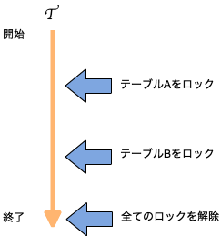
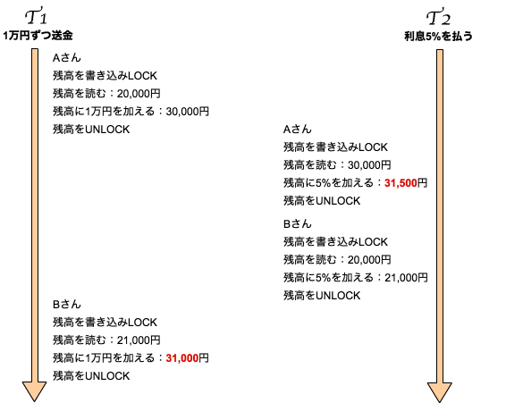
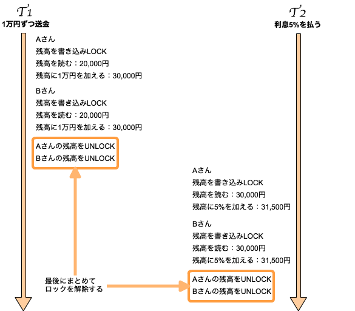
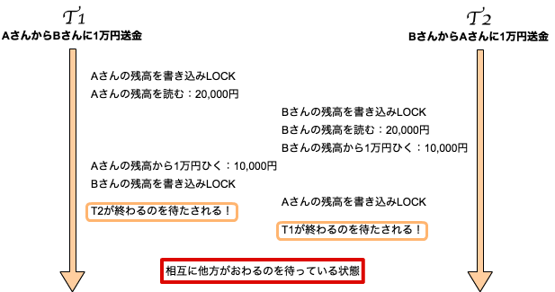
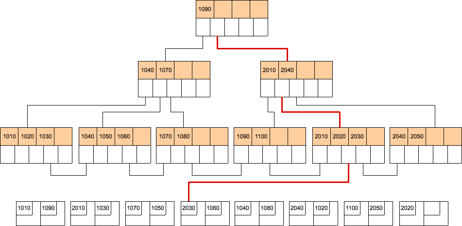
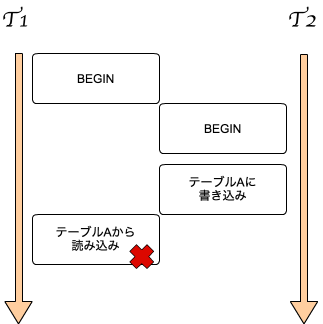

# chapter8　トランザクション制御とMVCC

## 二相ロックの効果

二相ロックとは「2 Phase Lock」のこと。
二相？⇨二段階
1. ロックをかけることができる段階
2. ロックを解除する段階

- 二相ロックを使用しない例

- 二相ロックを使用する例

早めにロックを解放したことによって、同じ処理内容なのに結果が異なる問題が発生している。

- 二相ロックの効果
	- トランザクション間の干渉を防ぐ
	- トランザクションが直列に実行されたように見せることができる

- 直列化可能性（serializability）
トランザクションがあたかも順次実行されたように見えること

- スケジュール
上の図のような実際のトランザクションとデータベースのアクションを時間軸に並べたもの

データベースはロックを利用してスケジュールをうまく制御してトランザクションが順次直列に実行されたように見せている。

## デッドロック

双方のロックの解放を待つ状態を「デッドロック」という。

- 対処法
	- トランザクションを完了させる
	- DBMSがデッドロックを検知した場合、一方を強制終了させて、もう一方を処理する
	- 検知できなかった場合は手動でトランザクションを終了させる

## インデックスなどの内部ロック

### インデックスを使った検索

- ルートノードからリーフノードへ向かって探しにいく
- ルートノードから目標のリーフノードまでの一連のブロックを読み込みロックしなければならない

### インデックスの更新

- ルートノードからリーフノードまでの一覧を書き込みロックする必要がある
- 二相ロックに従うと他のトランザクションが存在しない時に更新する必要がある
	⇨現実的ではないため「ツリープロトコル」という考え方でロックを制御している
    
### ツリープロトコル

- ルール
  - あるノードのロックを獲得
  - 獲得しているノードの子ノードのロックを獲得
  - 個別のノードのロックはいつでも解放できる
  - ロックを解放したら、そのノードのロックは獲得できない

- 例

1. ルートノードのロックを獲得
2. 次に子1ノードのロックを獲得
3. ルートノードのロックを解放
4. 次に子2ノードのロックを獲得
5. 子1ノードのロックを解放

ロックされる範囲を絞り込んでいる。

## タイムスタンプを使った同時実行制御

ロック以外の同時実行制御の方法としてタイムスンタンプを使った方法が存在する。
トランザクション開始時にそれぞれのデータベース資源（テーブル、タプル）に実行時刻（通し番号）をつけて、強制的に実行の順番を制御するもの。

T1がテーブルAから値を読み込む際、タイムスタンプを見ることで別のトランザクションによって更新された値と認識されるのでT1の処理がアボートする。
例ではアボートするトランザクションが１つだが、あるトランザクションがアボートしたことによって別のトランザクションをアボートせざるを得ない状況になり無限にアボートを繰り返す場合もある。
これを「カスケーディングアボート」という。

## マルチバージョン同時実行制御

タイムスタンプを使った同時実行制御では正しい処理をしていても強制的にアボートされる危険性が大きい。これを改善するためマルチバージョン同時実行制御（MVCC）を使用している。

MVCCの基本はタイムスタンプと同じだが、データを書き換えた際に古いデータをとっておく点が異なる。

## まとめ